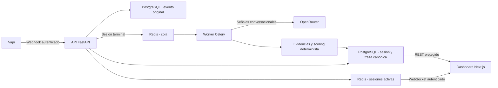

<div align="center">
  <h1>VoiceAgent Governance</h1>
  <p><strong>Gobernanza de agentes de voz mediante trazas auditables, evidencias reproducibles y evaluación accionable.</strong></p>

  <p>
    <a href="https://github.com/Dm19brea/VoiceAgent_Gobernance/actions/workflows/ci.yml"></a>
    
    
  </p>

  <p>
    
    
    
    
    
  </p>

  <p>
    <a href="./CONFIGURACION.md"><strong>Configuración</strong></a>
    ·
    <a href="#cómo-funciona"><strong>Arquitectura</strong></a>
    ·
    <a href="#funcionalidades-principales"><strong>Funcionalidades</strong></a>
  </p>
</div>

VoiceAgent Governance supervisa asistentes de voz integrados con **Vapi**. La plataforma recibe sus webhooks, conserva el evento original, reconstruye cada llamada como una secuencia de eventos canónicos y, al finalizar, genera evidencias y una evaluación determinista. Un dashboard protegido permite administrar los agentes gobernados, seguir llamadas activas y revisar transcripciones, puntuaciones y condiciones bloqueantes.

El proyecto sigue una arquitectura hexagonal: el dominio de gobernanza y scoring no depende de FastAPI, SQLAlchemy, Celery ni de ningún proveedor externo. Esto mantiene separadas la captura de datos, su interpretación y la evaluación final.

## Contenido

- [Qué aporta](#qué-aporta)
- [Cómo funciona](#cómo-funciona)
- [Stack tecnológico](#stack-tecnológico)
- [Instalación y ejecución](#instalación-y-ejecución)
- [Estructura del proyecto](#estructura-del-proyecto)
- [Funcionalidades principales](#funcionalidades-principales)
- [Seguridad y autenticación](#seguridad-y-autenticación)
- [Calidad y validación](#calidad-y-validación)

## Qué aporta

Una integración convencional guarda grabaciones o transcripciones. Esta plataforma construye una cadena de gobernanza completa:

```text
webhook original → evento canónico → evidencia trazable → métrica → informe
```

Cada evidencia referencia los eventos que la sustentan y cada informe conserva el *snapshot* de métricas utilizado para evaluarla. El modelo actual puntúa tres dimensiones con métricas efectivas —**conversacional**, **técnica** y **riesgo/seguridad**— y mantiene la dimensión operacional en el dominio para futuras métricas. Una dimensión sin métricas se excluye del cálculo en lugar de puntuarla artificialmente con cero.

El informe aprueba con una puntuación global de **75 o más**, salvo que exista una condición bloqueante, como una sesión fallida, un objetivo conversacional incumplido o un error técnico no recuperado.

> [!NOTE]
> La trazabilidad disponible permite consultar eventos y evidencias por sesión. El *snapshot* de métricas se persiste en el informe, pero la API todavía no expone esas métricas ni materializa un enlace directo `Metric → Evidence`; esa navegación debe reconstruirse mediante el criterio de la evidencia.

## Cómo funciona



1. La API valida la credencial `Authorization: Bearer <VAPI_WEBHOOK_SECRET>` y comprueba que el `assistantId` pertenece a un agente gobernado.
2. El webhook aceptado se guarda como evento original y, si tiene equivalencia conocida, se transforma a la taxonomía canónica del dominio.
3. La llamada se correlaciona mediante el `call.id` de Vapi y se persiste como una traza ordenada e idempotente.
4. Redis mantiene el estado efímero de las sesiones activas y el dashboard lo recibe por WebSocket.
5. Al llegar el evento terminal, Celery deriva la conversación, detecta silencios, consulta al juez conversacional y construye las evidencias.
6. El evaluador normaliza las métricas, calcula las puntuaciones ponderadas y persiste un único informe por sesión.

Los enriquecimientos externos son de tipo *best effort*: una indisponibilidad de Redis u OpenRouter no invalida la ingesta ni sustituye a PostgreSQL como fuente de verdad.

## Stack tecnológico

Las versiones indicadas proceden de los manifiestos, archivos de bloqueo o configuración de despliegue del repositorio.

| Área | Tecnología | Versión verificada | Responsabilidad |
|---|---|---:|---|
| Backend | Python | 3.12 o superior | Runtime de la API, dominio y worker |
| API | FastAPI + Uvicorn | 0.139.0 / 0.49.0 | REST, webhook de Vapi y WebSocket |
| Persistencia | PostgreSQL | 16 | Eventos originales, agentes, sesiones, evidencias, informes y credenciales |
| ORM y migraciones | SQLAlchemy + Alembic | 2.0.51 / 1.18.5 | Acceso asíncrono con `asyncpg` y evolución del esquema |
| Procesamiento asíncrono | Celery | 5.6.3 | Enriquecimiento, evidencias y evaluación post-llamada |
| Broker y tiempo real | Redis | 7 (servidor) | Cola Celery y estado de sesiones activas |
| Integraciones | Vapi + OpenRouter | APIs externas | Proveedor de voz, validación de asistentes y juez conversacional |
| Frontend | Next.js + React | 16.2.10 / 19.2.4 | Dashboard de operación |
| Estado remoto | TanStack Query | 5.101.2 | Consultas, caché e invalidación en el cliente |
| Visualización | Recharts | 3.9.2 | Gráficas de puntuación por dimensión |
| Estilos | Tailwind CSS | 4.3.2 | Interfaz responsive y tema claro/oscuro |
| Toolchain frontend | Node.js + TypeScript | 22.x / 5.9.3 | Desarrollo, compilación y tipado |
| Pruebas | pytest, Vitest y Playwright | 9.1.1 / 4.1.9 / 1.61.1 | Dominio, integración, UI y recorrido E2E |
| Despliegue | Docker + Railway | Configuración versionada | API, worker y frontend como servicios separados |

El backend usa **uv** para resolver dependencias y un `uv.lock` versionado; el frontend usa `npm` con `package-lock.json`.

## Instalación y ejecución

> [!IMPORTANT]
> La fuente de verdad para preparar el entorno, configurar Vapi, conectar `VAPI_WEBHOOK_SECRET` y desplegar en Railway es **[CONFIGURACION.md](./CONFIGURACION.md)**. La siguiente sección es únicamente la ruta rápida local.

### Requisitos

- Docker Desktop
- Python 3.12 y [uv](https://docs.astral.sh/uv/)
- Node.js 22.x
- Una API key de Vapi
- Una API key de OpenRouter para el juez conversacional

### Ruta rápida local

```bash
git clone https://github.com/Dm19brea/VoiceAgent_Gobernance.git
cd VoiceAgent_Gobernance

# PostgreSQL y Redis
docker compose up -d db redis

# Configuración del backend
cp backend/.env.example backend/.env
```

Completa `VAPI_API_KEY` y `OPENROUTER_API_KEY` en `backend/.env`. Después instala el backend y aplica las migraciones:

```bash
cd backend
uv sync
uv run alembic upgrade head
uv run uvicorn src.main:app --port 8000
```

En una segunda terminal, inicia el worker:

```bash
cd backend
uv run celery -A src.infrastructure.celery.app.celery_app worker --loglevel=info
```

En una tercera terminal, inicia el dashboard:

```bash
cd frontend
npm install
npm run dev
```

Abre <http://localhost:3000>. En el primer acceso, `/setup` crea la cuenta de operador y genera los secretos de la aplicación. Para exponer el webhook a Vapi, registrar el asistente y completar una prueba extremo a extremo, continúa en la **[guía de configuración](./CONFIGURACION.md#paso-8--exponer-la-api-a-vapi-túnel)**.

Comprobación mínima de la API:

```bash
curl http://localhost:8000/health
# {"status":"ok"}
```

### Despliegue

Railway ejecuta cinco servicios: **PostgreSQL, Redis, API, worker y frontend**. Los archivos `backend/railway.json`, `backend/railway.worker.json` y `frontend/railway.json` versionan los comandos y comprobaciones de salud. Consulta la sección **[Entorno Railway](./CONFIGURACION.md#parte-2--entorno-railway)** para configurar variables, dominios, CORS y el webhook sin exponer secretos.

## Estructura del proyecto

```text
.
├── .github/
│   ├── workflows/              # CI de backend/frontend y análisis SAST
│   └── dependabot.yml          # Actualizaciones semanales de dependencias
├── backend/
│   ├── alembic/                # Migraciones del esquema PostgreSQL
│   ├── scripts/                # Comprobaciones operativas puntuales
│   ├── src/
│   │   ├── domain/             # Entidades, invariantes, evidencias y scoring puro
│   │   ├── application/        # Casos de uso, comandos y puertos
│   │   ├── adapters/           # REST, WebSocket, Vapi y OpenRouter
│   │   ├── infrastructure/     # SQLAlchemy, Redis, Celery y configuración
│   │   └── main.py             # Composición de la aplicación FastAPI
│   ├── tests/                  # Pruebas unitarias y de integración
│   ├── Dockerfile
│   └── pyproject.toml
├── frontend/
│   ├── e2e/                    # Recorrido de operador con Playwright
│   ├── public/                 # Recursos estáticos
│   ├── src/
│   │   ├── app/                # Rutas Next.js: sesiones, agentes, login y setup
│   │   ├── components/         # Vistas, tablas, gráficas y controles
│   │   ├── lib/                # Cliente API, autenticación, queries y transcripción
│   │   └── test/               # Infraestructura de pruebas con MSW
│   ├── package.json
│   └── playwright.config.ts
├── docs/
│   ├── design/                 # Decisiones y cobertura del modelo de gobernanza
│   └── validation/m7/          # Protocolo y evidencias de validación extremo a extremo
├── CONFIGURACION.md            # Guía completa para local y Railway
└── docker-compose.yml          # PostgreSQL y Redis para desarrollo local
```

### Capas del backend

| Capa | Contiene | Regla principal |
|---|---|---|
| `domain` | `Agent`, `Session`, `Event`, `Evidence`, scoring y políticas | No conoce frameworks ni infraestructura |
| `application` | Casos de uso y puertos (`Protocol`) | Orquesta el dominio mediante abstracciones |
| `adapters` | Contratos HTTP/WS y traducción de proveedores | Convierte entradas externas a comandos internos |
| `infrastructure` | PostgreSQL, Redis, Celery y repositorios | Implementa los puertos y conecta servicios |

## Funcionalidades principales

### Gobierno de asistentes

- Alta y edición de agentes mediante su `assistantId` de Vapi.
- Verificación remota de que el asistente existe antes de registrarlo.
- Baja lógica para conservar su historial de sesiones.
- Descarte temprano de webhooks pertenecientes a asistentes no gobernados o eliminados.

### Ingesta y trazabilidad

- Autenticación del webhook mediante la credencial `Authorization: Bearer <VAPI_WEBHOOK_SECRET>` (autentica el origen: la organización de Vapi, no al asistente individual — ver [nota sobre el fallback de credenciales](#nota-el-bearer-autentica-el-origen-no-al-asistente)).
- Conservación del payload original en PostgreSQL antes de su interpretación.
- Traducción de eventos Vapi a una taxonomía canónica independiente del proveedor.
- Correlación de una llamada con una única sesión y secuencias de eventos ordenadas.
- Identidades deterministas y restricciones de base de datos para tolerar reintentos y redeliveries.

### Evidencias y evaluación

- Extracción post-terminal de turnos del agente y del usuario.
- Detección determinista de silencios prolongados y registro de interrupciones notificadas por Vapi.
- Juez conversacional vía OpenRouter para cambios de tema y cumplimiento del objetivo.
- Evidencias directas e inferidas con referencia a sus eventos de origen.
- Scoring ponderado y reproducible por dimensión, con métricas ausentes excluidas.
- Flags bloqueantes que pueden invalidar una sesión aunque su puntuación sea alta.
- Registro de latencias, errores y hallazgos como observaciones del sistema.

### Operación desde el dashboard

- Configuración guiada de la cuenta en el primer arranque.
- Inicio de sesión y renovación silenciosa de la sesión del operador.
- Listado y filtrado de sesiones por agente.
- Supervisión en tiempo real del interlocutor activo y de interrupciones recientes.
- Transcripción visual con turnos, interrupciones y periodos de silencio.
- Informe con nota global, resultado, puntuación por dimensión y flags bloqueantes.
- Administración de agentes gobernados desde la interfaz.

## Seguridad y autenticación

| Superficie | Protección actual |
|---|---|
| Dashboard REST | JWT de acceso de 15 minutos en `Authorization: Bearer …` |
| Renovación | Cookie `HttpOnly`; ventana deslizante de 30 minutos y límite absoluto de 8 horas |
| Revocación | `session_epoch` persistido; el cierre de sesión invalida los tokens anteriores |
| Credenciales | Contraseña con hash bcrypt; secretos generados en el primer setup y persistidos en PostgreSQL |
| WebSocket | Token de acceso validado contra secreto y epoch actuales antes de aceptar la conexión |
| Webhook Vapi | Comparación en tiempo constante de `Authorization: Bearer <secreto>` y rechazo antes de persistir |
| Datos expuestos | Allowlist de campos para no devolver payloads completos del proveedor al dashboard |
| Secretos locales | Archivos `.env` ignorados por Git; solo `.env.example` se versiona |

`JWT_SECRET` y `VAPI_WEBHOOK_SECRET` admiten una sobrescritura explícita por entorno, pero por defecto se generan durante `/setup`. El secreto del webhook se muestra una sola vez: sigue las instrucciones de **[CONFIGURACION.md](./CONFIGURACION.md#paso-8--exponer-la-api-a-vapi-túnel)** para guardarlo en Vapi con el encabezado correcto.

### Nota: el Bearer autentica el origen, no al asistente

La credencial del webhook de Vapi autentica el **origen** de la petición (tu organización de Vapi), **no** al asistente concreto. Esto es clave para entender qué puede y qué no puede hacer la validación `Authorization: Bearer`.

**Credential Fallback.** En el selector de autorización de un asistente, la opción "No authentication" **no** implica que su webhook llegue sin autenticar. Mientras la organización tenga una **credencial de servidor predeterminada** ("Default Server Credential"), Vapi la aplica por *fallback* a todo asistente que no tenga una credencial propia seleccionada. En ese caso Vapi **sí** adjunta la cabecera de esa credencial global — normalmente `Authorization: Bearer <token>` — y el backend la valida como correcta.

**Configuración confirmada de esta instalación.** La organización tiene una única credencial de servidor, `Vapi Webhook Secret`, de tipo **Bearer Token**, cabecera `Authorization`, con el prefijo `Bearer` activado. Por tanto, todo asistente sin credencial propia hereda ese mismo `Authorization: Bearer <VAPI_WEBHOOK_SECRET>`. El `VAPI_WEBHOOK_SECRET` del backend debe contener exactamente ese token.

**Implicación.** Como el mismo secreto viaja para todos los asistentes de la organización, el Bearer **no puede distinguir por sí solo qué asistente debe registrarse**: solo demuestra que la llamada proviene de la cuenta de Vapi. El gate por-asistente NO es implementable únicamente con la validación del Bearer.

**Cómo se decide hoy qué se registra.** El único filtro por-asistente vigente es la comprobación de gobernanza: el backend resuelve el `assistantId` del payload y **descarta** la llamada si el asistente no está registrado como agente gobernado (o está dado de baja). Para gatear un asistente que sí quieres tener registrado pero no trackear, hay dos vías: (a) asignar/quitar credenciales explícitamente por asistente en Vapi **y desactivar el fallback de la organización**, o (b) introducir un gate propio en la plataforma (un flag por-agente comprobado tras resolver el `assistantId`).

## Calidad y validación

La integración continua ejecuta:

- **Backend:** Ruff, comprobación de formato, mypy en modo estricto y pytest.
- **Frontend:** ESLint, TypeScript, Vitest, build de Next.js y Playwright en Chromium.
- **Seguridad:** Bandit SAST sobre el backend.
- **Dependencias:** Dependabot para uv, Docker y GitHub Actions.

Comandos habituales:

```bash
# Backend
cd backend
uv run ruff check .
uv run ruff format --check .
uv run mypy src tests
uv run pytest

# Frontend
cd frontend
npm run lint
npm run typecheck
npm run test
npm run build
npm run test:e2e
```

El repositorio incluye además un [protocolo de validación M7](./docs/validation/m7/validation-protocol.md) y [resultados comparados de llamadas reales](./docs/validation/m7/cross-run-analysis.md) para los escenarios de confirmación, reprogramación y cancelación de citas.

---

Para configurar el proyecto sin omitir ningún paso, continúa en **[CONFIGURACION.md](./CONFIGURACION.md)**.
